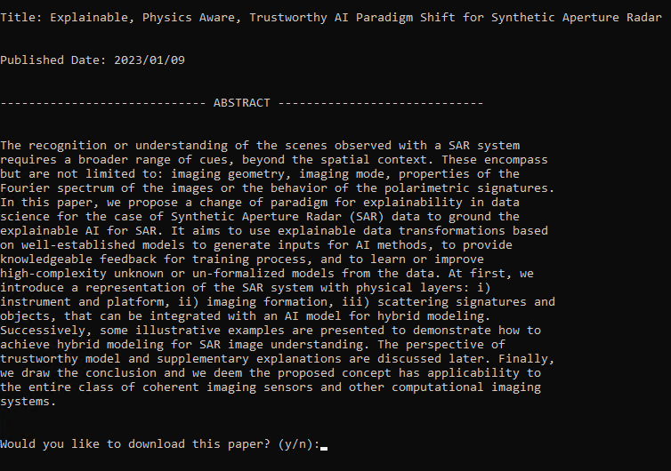

# AI Research Initiatives

This repository exists specifically for code and artifacts from independent research efforts. 

Further information, such as tutorials/guides centered around research, will be surfaced via a future Jupyter Book. 

## Scripts

In the "scripts" folder you'll find supporting scripts for aiding in research, such as finding relevant research papers or data. The following files currently exist: 

* requirements.txt - Python libraries needed to run the files
* searchArxiv.py - covered in next section

### searchArxiv

searchArxiv.py is a small helper script for finding and downloading relevant research papers from the popular article distribution service, arXiv.

The sheer amount of papers published daily on arXiv makes it extremely difficult to keep up with, let alone finding ones that are relevant to you. This allows me to only focus on a simple command window to see the title, published date, and abstract of papers. Further, I can provide how many papers I want to return and what words I want to search for in the title and abstract. The goal is to make finding papers a faster/easier process.

arguments:
* --titlequery
  * words or phrases you want to search for in paper titles (default = "ai")
* --abstractquery
  * words or phrases you want to search for in paper abstracts (default = "ai")
* --papercount
  * maximum number of papers you want the query to return (default = 5)
* --datelag
  * how far back (in # of weeks) you want to search for, based on a paper's published date (default = 24)
* --savepath
  * provide a system path of where to save downloaded papers (default = current directory)
